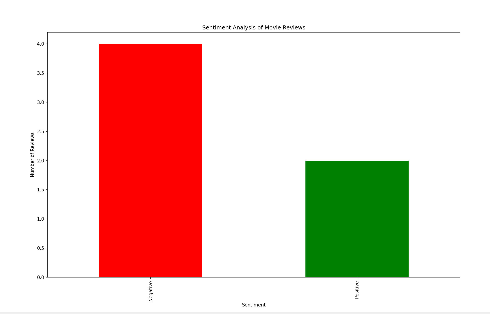

# AI Sentiment Analysis: Movie Reviews

This AI/Machine Learning project uses NLTK's VADER sentiment analyzer to classify movie reviews as Positive, Negative, or Neutral. It also visualizes the results in a bar chart.
You can basically write a review for a movie, the AI will then classify what you wrote about the movie as Positive, Negative, or Neutral. 
For example, "This movie truly showcases strength and resilience" is a Positive review whereas "This movie was too long and the characters were underperforming" is a Negative one. 

## How to Run
1. Clone this repo
2. Create virtual environment: `python -m venv venv`
3. Activate virtual environment:
   - Windows: `.\venv\Scripts\activate`
   - Mac/Linux: `source venv/bin/activate`
4. Install requirements: `pip install pandas matplotlib nltk`
5. (Optional): Try deleting, adding, or modifying the existing sample reviews to get different results. 
6. Run the project: `python sentiment_analysis.py`

## Example Output
| Review                                           | Sentiment |
|--------------------------------------------------|-----------|
| This movie was fantastic! The acting was brilliant. | Positive  |
| I hated this movie. It was too long and boring.     | Negative  |

